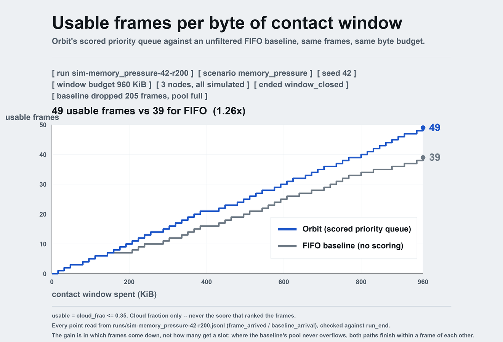

# Orbit — satellites score their own imagery; the ground decides who downlinks

Earth-observation satellites capture far more than they can send. A satellite only
downlinks while passing over a ground station, a few minutes at a time, and a large
share of what it captured is not worth the airtime — cloud, blur, nothing changed.
Nearly a third of this repository's own corpus is too cloudy to use (`cloudy_frames: 56`
of 194, `corpus/gate_result.json`), and the satellite cannot tell which third without
looking. So the scarce contact window gets spent on whatever is next in the buffer while
good frames sit unsent.

Orbit: **each satellite scores every frame onboard, keeps a priority queue, and bids
its best frame when the ground opens a slot. The ground grants one slot to one
satellite, that satellite transmits to completion, and arbitration runs again.**
ESA's Φ-sat-1 (2020) proved one satellite can filter its own imagery onboard; the
multi-satellite arbitration is the part nobody has flown.

ESP32-S3 satellites share one ground station — this repository — over a UDP multicast
bus. The roster is three in simulation and two on the bench: the boards call themselves
`esp32-satellite-b` and `esp32-satellite-c`. Their firmware is in `firmware/`. HackMIT 2026.

## How a slot is decided

```
priority = score
         + item_age_seconds       × ITEM_AGING_RATE    (0.5)
         + satellite_wait_seconds × SAT_AGING_RATE     (0.3)
```

Per slot, event driven, on each satellite's **top item only**. No time slicing, no
round robin, no preemption: a satellite that keeps winning genuinely holds the best
frames. Fairness comes from the two aging terms — item aging stops a frame being
stranded behind newer arrivals; satellite aging stops a whole satellite that scores a
little lower from being locked out, which item aging alone can never fix. Ties go to
the lowest hostname, so a run replays identically from its seed.

The bid also carries a *window* of the next few queue entries. It is diagnostic: the
arbiter never reads it, the display does — it is how an operator sees queue shape.

## What is real and what is simulated

**The corpus is real.** 194 NASA GIBS MODIS Terra frames, 14 scenes over 16 dates in
2024, 128×128 grayscale, committed to the repository — `orbit/corpus/__init__.py` sets
`SYNTHETIC = False`. Provenance, the source URL and sha256 of every frame, and NASA's
usage statement are verbatim in `corpus/manifest.json`, along with the 30 requests that
were skipped and the reason for each. Nothing is generated.

**The scoring is real.** One integer kernel, and every tier is held to it rather than
trusted. `tools/check_score_parity.py` compiles the firmware's
`firmware/satellite_esp32/orbit_score.h` with g++ and compares it to
`orbit/golden/score.py` on all seven intermediates — `cloud_px, changed_px, sobel_sum,
clear, sharp, change, score` — bit for bit, with no board attached. The benchmark
records the same identity check per run in `results/bench.jsonl`:
`numpy_matches_golden` is true on all four recorded runs, and `torch_matches_golden` is
true on the two GPU-tier runs and `null` on the two CPU-tier runs, which never ran the
torch kernel and so never checked it. `null` means not checked, not "passed".

**The satellites are simulated by default.** `orbit sat` processes run the identical
kernel over the same corpus. Two real ESP32-S3 boards exist — `esp32-satellite-b` and
`esp32-satellite-c` — and their firmware is in `firmware/`. Which is which is not
something anyone has to take on trust: every satellite carries a `real` boolean on the
wire (`docs/event_stream.md`, the `nodes` list in `run_start`), and the dashboard shows
it per satellite at all times (`display/live.html` — green for a real board, amber for
simulated).

**The contact window is modelled, not performed.** There is no radio link and no
orbital propagation. A window is a byte budget, `duration × rate / 8`, with one fixed
frame debited per confirmed transmission. The demo runs scaled down for a three-minute
judging slot: `window_duration_s = 120.0` and `link_rate_bps = 65_536.0`. The unscaled
reference figures sit beside them in `orbit/config.py` as `REAL_WINDOW_DURATION_S =
600.0` and `REAL_LINK_RATE_BPS = 10_000_000.0`. They are reference figures, not
measurements of any link.

**The benchmark numbers are measured, and the holes are named.** Every figure in
`results/bench.jsonl` carries `method`, `scope` and `measured`. GPU-die power, energy
and temperature are instrumented through NVML. CPU-rail and whole-board power read
`"unavailable"` with the reason — they need an inline USB-C PD meter this project does
not have. Per-frame energy on the ESP32 has not been measured at all: no board is
instrumented, so there is no figure to quote.

**The webcam demo is live proof that the scoring is real.** `camera/` takes one frame
from the browser's own camera, reduces it to the 128×128 gray the board works in, and
scores it with the same kernel at the queue's real depth. It runs on its own port and
is deliberately not in the arbitration path — nothing it does can reach a decision.

**Deliberately not here**, and consistent with `ARCHITECTURE.md`: FPGA/HDL (the
previous design), orbital propagation, an NPU tier, relay, time-sliced scheduling, a
message broker.

## Run it

```bash
curl -LsSf https://astral.sh/uv/install.sh | sh          # once; uv brings its own Python 3.13
uv sync                                                 # add --extra gpu for the torch benchmark tier

uv run orbit sim --scenario memory_pressure --rounds 50 --seed 42   # deterministic 50-slot table
uv run orbit demo --scenario nominal --display          # ground + 3 satellites + dashboard, real multicast
uv run orbit bench --tier cpu,gpu                       # energy/efficiency baseline (see results/)
uv run orbit bus-smoke --listen      # on a second device on the same WiFi …
uv run orbit bus-smoke --send        # … then here: does client-to-client multicast work?
```

Live pieces, each its own process (a real satellite replaces an `orbit sat`):

| command | what |
|---|---|
| `orbit ground` | the arbiter on `239.255.42.99:50000`; JSONL event stream on `ws://:8766` and `runs/<run_id>.jsonl`; UDP telemetry to `display.local:50010` |
| `orbit sat --profile sat-a` | one simulated satellite: fixed frame pool, local eviction, onboard scoring on the committed MODIS corpus |
| `orbit display` | the monitoring page (normally on the laptop), fed only by telemetry — never in the control path |
| `uv run python -m viz.replay runs/x.jsonl` | replay a recorded run into a running `orbit display`; sends telemetry, serves no page of its own |

Any setting: `--set name=value` anywhere on the command line, or `ORBIT_<NAME>=…`.
Everything tunable is one frozen dataclass in `orbit/config.py`.

Scenarios: `nominal`, `memory_pressure` (one satellite captures 8× faster than the
link drains and evicts constantly), `low_scorer` (one satellite scores 15 points
lower; watch satellite aging lift it), `revoke` (a satellite accepts grants and never
transmits), `lossy` (20 % duplicates, 10 % reorder, 2 % drop), `late_joiner`.

## What is measured

`results/bench.jsonl` holds the identical scoring kernel timed on the GX10 CPU and
GPU with the same 194 real MODIS frames. Every figure carries `method`, `scope` and
`measured`; anything this machine cannot measure says `"unavailable"` and why. On
the GX10 only GPU-die power is instrumented (NVML); CPU and whole-board power need
an inline USB-C PD meter and are reported as unavailable, not estimated.

The demo's headline is `run_end` in every run file: usable frames downlinked by Orbit
versus a first-in-first-out baseline given the *same byte budget*, where "usable"
is cloud fraction ≤ 0.35 — never the score that did the ranking.



Drawn by `tools/plot_value.py` straight from a run file, checked against that file's own
`run_end` totals before anything is plotted. Regenerate it with:

```bash
uv run orbit sim --scenario memory_pressure --seed 42 --rounds 200 \
  --run-id sim-memory_pressure-42-r200
uv run python tools/plot_value.py runs/sim-memory_pressure-42-r200.jsonl
```

**What this does and does not claim.** `memory_pressure` is the scenario where the
satellite's pool overflows and frames have to be thrown away — the baseline dropped 205
of them here — and choosing *which* ones to keep by score is what pays. Where nothing
overflows, both paths finish within a frame of each other over a full window
(`nominal` 37 vs 36, `late_joiner` 35 vs 36). The advantage is a contention result, not
a general throughput win, and the chart says so on its face.

## Map

```
orbit/config.py            every constant and tunable
orbit/protocol/messages.py the bus wire protocol            docs/protocol.md
orbit/protocol/auth.py     control-bus authenticity (HMAC + ground Ed25519)  docs/security.md
orbit/arbiter/             priority formula, ground FSM, contact window, flags
orbit/bus/                 multicast bus, loopback twin, dedup with restart detection
orbit/sim/                 simulated satellites, scenarios, deterministic harness
orbit/ground/              live station, telemetry, display event stream   docs/event_stream.md
orbit/bench/               energy/efficiency benchmark
orbit/golden/              the scoring kernel (integers, bit-exact) and queue
corpus/                    194 NASA GIBS MODIS frames, offline
firmware/                  the ESP32-S3 sketch and its host-compiled harnesses  firmware/README.md
camera/                    the webcam scoring demo, its own port, off the control path
viz/                       the monitoring page the ground serves, + replay
display/                   the standalone sheet, fed from a run file           docs/event_stream.md
tools/                     the checks that need no board, and the stdlib replay server
runs/                      recorded and fixture run files, so the display always has something to open
tests/                     the suite: uv run pytest
```

## The display

Two ways to look at a run, both reading the same event stream
(`docs/event_stream.md`):

```sh
uv run orbit demo --scenario nominal --display   # live: the ground serves viz/ on :8765
uv run orbit display                             # then, in a second terminal:
uv run python -m viz.replay runs/<id>.jsonl      # the same page, from a recorded run

python3 tools/replay.py runs/sample.jsonl        # display/live.html on :8000, stdlib only
python3 tools/check_run.py runs/sample.jsonl     # hold any run file against the contract
```

`tools/replay.py` needs nothing installed — no uv, no venv, no network — so the
sheet still opens on a borrowed laptop. `--speed 20` to skim, `--loop` to leave it
running. Every run the ground writes lands in `runs/<run_id>.jsonl` and any of them
can be replayed; `runs/sample.jsonl` and `runs/demo-*.jsonl` are kept in the
repository so there is always something to open.

## tools/ — what can be checked without a board

Every one of these runs without a board attached except `bus_round.py`, and each exists
because a specific failure was expensive to find on the bench.

| tool | what it proves |
|---|---|
| `check_score_parity.py` | builds `firmware/satellite_esp32/orbit_score.h` with g++ into `firmware/test/score_host` on demand, feeds it the same corpus frame/ref pairs the satellite would score, and compares **all seven intermediates** — `cloud_px, changed_px, sobel_sum, clear, sharp, change, score` — against the Python golden model. Not just the final number, so a failure names the term that drifted. No board attached. |
| `check_firmware_sync.py` | fails the build when firmware constants drift from `orbit/config.py`: 17 constants plus the multicast group, and every fault's integer `code_id` **and** its severity string. The ids and names are parsed back out of the header the firmware actually compiles against, so it catches the same-name/different-number case — a board saying 7 while the ground reads 7 as something else. |
| `check_message_schema.py` | parses the `.ino` and its headers for the fields the firmware actually writes, following helpers like `fillEnvelope` so they count as the fields they set, and derives REQUIRED vs OPTIONAL on the ground's side by deleting each field from that type's own example vector and asking `decode()` whether it still accepts it. MISSING is fatal; EXTRA is a warning, because `from_doc` ignores keys it does not know. |
| `build_fs_image.py` | lays out the LittleFS image for one satellite — frames, scene references, manifest — with a zlib CRC-32 per blob taken over the exact bytes written, which the firmware checks at boot before it captures anything. It catches a flash write that returned OK and left the image short. |
| `check_run.py` | holds any run file against `docs/event_stream.md`: envelope ordering, event shapes, frame lifecycles, queue depths, grants, window accounting, the usable rule, and `run_end` totals. Stdlib only. |
| `replay.py` | replays a run file over the display's WebSocket honouring `t`, and serves `display/live.html`, the thumbnails, `/api/state` and the run files beside it. Stdlib only, Python 3.9+ — nothing to install on a borrowed laptop. |
| `bus_smoke.py` | one command that answers "is UDP multicast actually working between these two machines", with `--unicast <ip>` as the control, so "unicast works, multicast doesn't" is a one-command diagnosis. |
| `bus_round.py` | drives one complete arbitration round against a real ESP32 exactly as the ground would, built and parsed with the ground's own protocol module rather than a second implementation of it, then re-scores the received frame with the golden model. This is the one that needs a board. |
| `plot_value.py` | plots the cumulative value-delivered curve out of a run file: bytes of contact window spent against usable frames delivered, Orbit's scored queue against the unfiltered FIFO baseline on the same budget. The pitch's one chart, drawn from a recorded run rather than from memory. |
| `make_sample.py` | generates `runs/sample.jsonl`, a fixture run to develop the display against: imaginary satellites, but real corpus ids scored with the golden model, so the thumbnails match the scores. It checks its own output with `check_run.py` before writing. |

The firmware checkers read the ground's side from `orbit/config.py` and
`orbit/golden/score.py` **themselves**, never from a second transcription of them — the
golden modules are copied into a throwaway package and imported from there, so an `orbit`
already on `sys.path` cannot be the one that answers. Both read the working tree by
default, which is the only source that catches the drift they exist for: a kernel constant
edited and not yet carried into the firmware header. `ORBIT_GOLDEN_REF=<ref>` reads them
from a git ref instead, for comparing across branches.

Firmware is testable against the real protocol with no hardware because the bus is an
interface, not a socket. `orbit/bus/base.py` defines it; `MulticastBus` is the wire and
`LoopbackHub` (`orbit/bus/loopback.py`) is the same bus in-process, through the same
encoder and decoder, with seeded duplication, reordering and loss so a codec bug cannot
hide behind the simulator. There is no URL scheme and nothing to configure: which one
you get is decided by which program you launch.

`uv run pytest`, `uv run mypy`, `uv run ruff check` and `uv run ruff format --check` are all expected clean; tests run with warnings as errors.
They are clean on the GX10. Off Linux, two `tests/test_bench.py` tests and four
`orbit/bench/runner.py` mypy errors appear, because `os.sched_getaffinity` and
`os.sched_setaffinity` do not exist there. Nothing else fails.
See `ARCHITECTURE.md` for the design and the reasons behind it.
